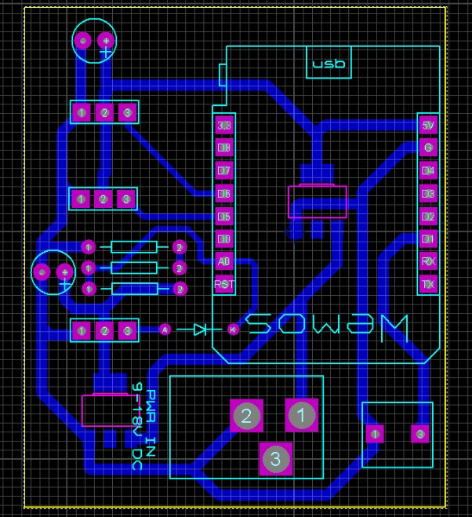

# Estacion recolectora Documento Técnico

**Introducción**:

Dispositivo conectado a wifi que permite recolectar informacion de sensores de humo (mq2), temperatura y humedad (DHT22), Movimiento (PIR), teniendo la capacidad de emitir alertas si en dado caso los valores no fueran los normales. 

**Componentes**:

SoC ESP8266 
Enlace: https://www.espressif.com/sites/default/files/documentation/0a-esp8266ex_datasheet_en.pdf

Sensor de temperatura y humedad DHT22 
Enlace:  https://www.sparkfun.com/datasheets/Sensors/Temperature/DHT22.pdf).

Sensor de Movimiento PIR 
Enlace: https://cdn-learn.adafruit.com/downloads/pdf/pir-passive-infrared-proximity-motion-sensor.pdf

Sensor de composición de Aire MQ2  
Enlace: https://www.pololu.com/file/0J309/MQ2.pdf

Componentes electrónicos discretos: 
Push button 2 pins
Resistencias 1/4 watt
Regulador de voltaje SMD 12 V a 5 V
Headers
Conector hembra para fuente de poder	

**Funcionamiento**: 

El dispositivo se conecta a la red por medio de WiFi (IEEE 802.11) recopilando datos mientras se mantenga encendido, enviando reportes de los sensores con sus respectivos estados cada cierto tiempo definido en el código como la constante ***tiempoEnvioDatos*** que por defecto esta en 15 segundos. 

**Observaciones**: 

Los sensores de movimiento y composición de aire están puestos en modo pull-up, solamente cuando haya un movimiento enviara un pulso positivo al pin definido en el código como **pinPIR**, en el caso del sensor de composición de aire, esta en modo digital, enviando un pulso positivo hacia el **pinGas** definido en el código, cuando la presencia de humo sea mayor ala calibrada. Ambos sensores pueden ser calibrados con un destornillador de tipo phillips o cruz pudiendo variar en el de movimiento el tiempo de envió del pulso y la sensibilidad del movimiento infrarrojo. El sensor de Composición de aire tiene también la capacidad de ser calibrado, dejando algunos minutos para que se pueda calentar después de encendido luego calibrándolo con un destornillador phillips.

El sensor de temperatura y humedad enviara alertas cuando los valores de humedad y temperatura sean mayores a **temValor1** y **humValor1** e inferiores a **temValor2** y **humValor2** esperando que en las siguientes fases del proyecto estos valores puedan ser actualizados en tiempo real. 

**Circuito**

**simulación**

